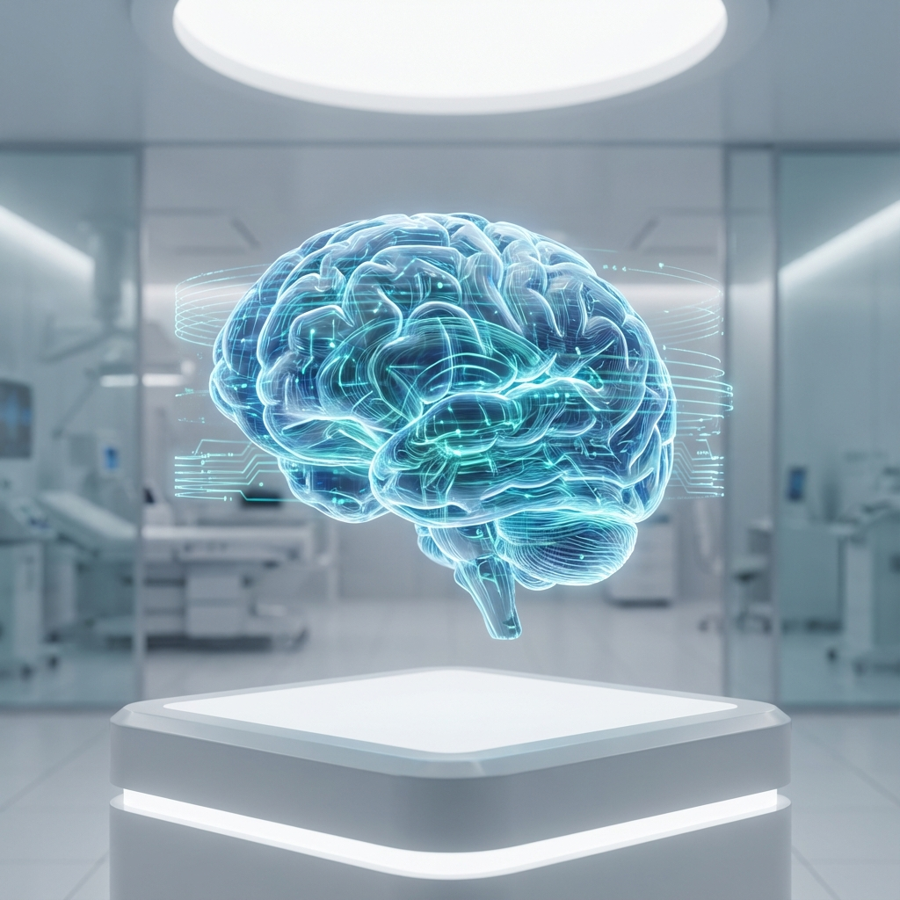

# NeuroScan - AI-Powered Brain Tumor Detection



> **Advanced Deep Learning System for MRI Analysis & Diagnosis**

NeuroScan is a state-of-the-art medical imaging application designed to assist radiologists and neurologists in the early detection of brain tumors. Leveraging Convolutional Neural Networks (CNN), the system analyzes MRI scans in real-time to identify Glioma, Meningioma, and Pituitary tumors with high precision.

## 🚀 Features

- **Instant AI Analysis**: Get diagnostic predictions in seconds.
- **High Accuracy**: Trained on thousands of MRI samples for reliable results.
- **Secure & Private**: Local processing ensures patient data privacy.
- **Modern Interface**: Intuitive, glassmorphism-based UI for seamless user experience.
- **Full Stack Architecture**: Robust Flask backend coupled with a responsive React frontend.

## 🛠️ Technology Stack

### Frontend
- **React 19**: Modern UI component library.
- **Vite**: Next-generation frontend tooling.
- **Tailwind CSS**: Utility-first CSS framework for styling.
- **Google Fonts (Inter)**: Professional typography.

### Backend
- **Python**: Core logic and data processing.
- **Flask**: Lightweight WSGI web application framework.
- **TensorFlow / Keras**: Deep learning model execution.
- **NumPy**: Numerical computing optimization.

## 📂 Project Structure

```text
/
├── backend/            # Python Flask API & ML Model
│   ├── app.py          # Main application entry point
│   ├── model2.h5       # Pre-trained CNN model
│   └── uploads/        # Temporary storage for processing
├── frontend/           # React Application
│   ├── src/            # Source code
│   └── public/         # Static assets
└── venv/               # Python Virtual Environment
```

## ⚡ Quick Start

### Prerequisites
- Node.js (v16+)
- Python (v3.9+)

### Installation

1.  **Clone the repository**
    ```bash
    git clone https://github.com/yourusername/neuroscan.git
    cd neuroscan
    ```

2.  **Setup Backend**
    ```bash
    # Create virtual environment
    python3 -m venv venv
    source venv/bin/activate  # On Windows: venv\Scripts\activate
    
    # Install dependencies
    pip install -r backend/requirements.txt
    ```

3.  **Setup Frontend**
    ```bash
    cd frontend
    npm install
    ```

### Running the App

We use `concurrently` to run both servers with a single command:

```bash
# In the frontend directory
npm start
```

- **Frontend**: http://localhost:5173
- **Backend**: http://localhost:5001

## 🧠 Model Information

 The background model is a custom **Convolutional Neural Network (CNN)** optimized for medical image classification. It has been trained on the [Brain Tumor Classification (MRI)](https://www.kaggle.com/datasets/sartajbhuvaji/brain-tumor-classification-mri) dataset.

### Classes Verified
- **Glioma Tumor**
- **Meningioma Tumor**
- **Pituitary Tumor**
- **No Tumor**

## 🛡️ Disclaimer

This tool is intended for **research and educational purposes only**. It should not be used as the sole basis for medical diagnosis. Always consult with a qualified healthcare professional.

---
&copy; 2025 NeuroScan AI. All rights reserved.
